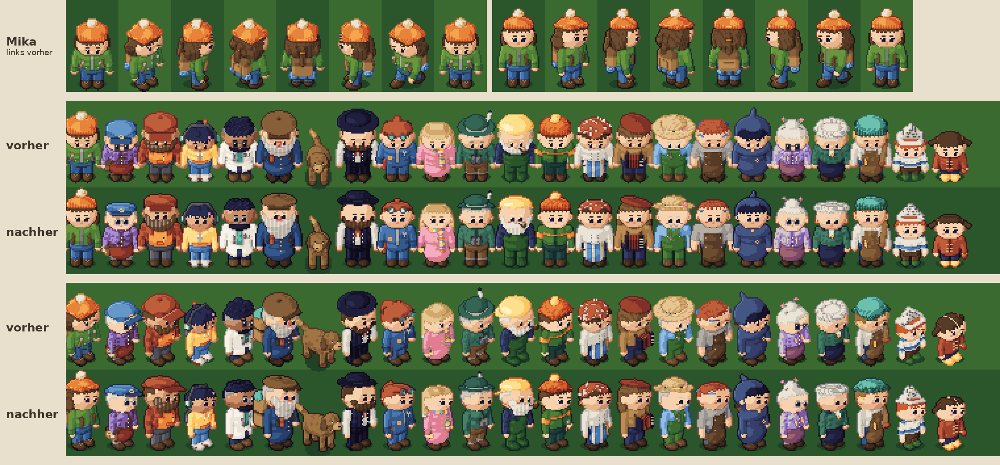
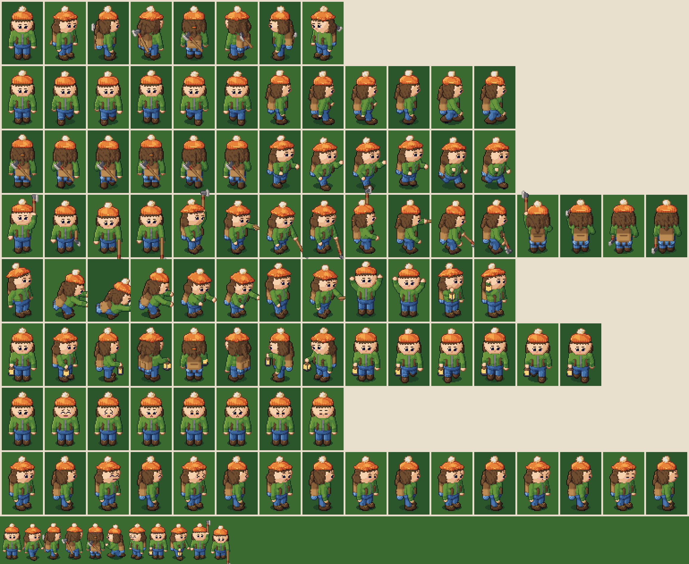
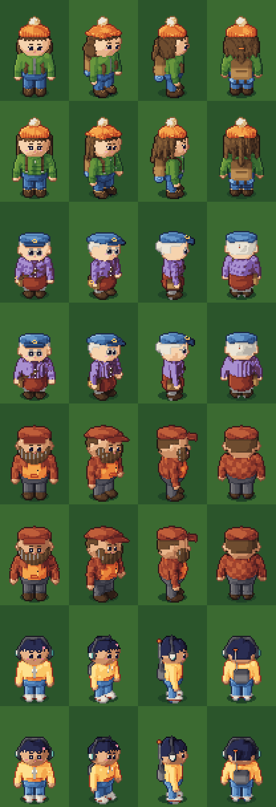
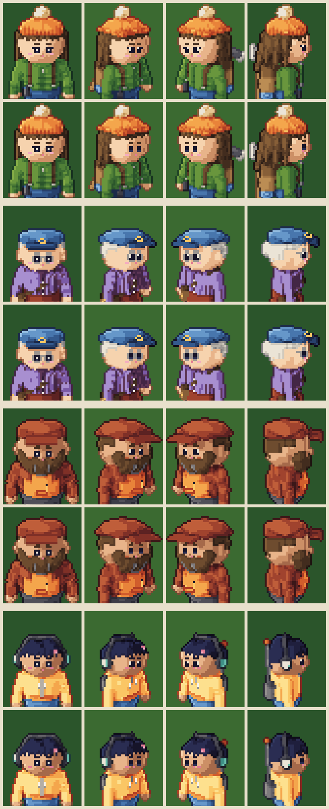
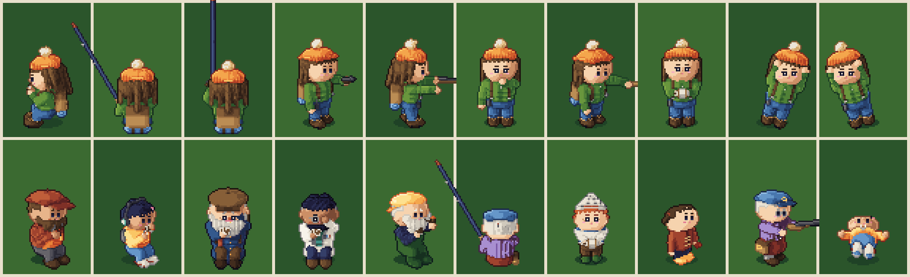

# Die Menschen als Sprites – schöner zeichnen (F5)

Stand: 01.10.2026 · Auftrag: »Hab mir die 2d Modelle angeguckt. Die Zombies gefallen mir. Die
Menschen könnten schöner sein. Recherchiere wie andere das machen und dann zeichne sie schöner.«

Die Schlurfer bleiben, wie sie sind (ein Fingerabdruck aller 510 Schlurfer-Bilder wird vor und
nach der Arbeit verglichen). Alles Neue gilt nur für die Menschen und ihre Werkzeuge.

## 1. Wie andere es machen

Quellen (gelesen über die Suche; einige Seiten sperrt das Netz der Arbeitsumgebung, ihr Inhalt
kam aus den Zusammenfassungen der Suche):

- SLYNYRD, [Pixelblog 22 – Top Down Character Sprites](https://www.slynyrd.com/blog/2019/10/21/pixelblog-22-top-down-character-sprites),
  [Pixelblog 55 – Top Down Character Animation](https://www.slynyrd.com/blog/2025/3/24/pixelblog-55-top-down-character-animation),
  [Pixelblog 29 – Anime Faces and Hair](https://www.slynyrd.com/blog/2020/7/28/pixelblog-29-anime-faces-and-hair),
  [Pixelblog 17 – Human Anatomy](https://www.slynyrd.com/blog/2019/5/21/pixelblog-17-human-anatomy)
- Derek Yu (Spelunky), [Pixel Art Tutorial: Basics](https://www.derekyu.com/makegames/pixelart.html);
  [pixnote: Outlines und Sel-out](https://pixnote.net/en/learn/outlines/),
  [pixnote: Figuren, Gesichter, Posen](https://pixnote.net/en/learn/character/)
- [sprite-ai: Anime-Pixel-Art](https://www.sprite-ai.art/blog/anime-pixel-art),
  [Sandro Maglione: Pixel-Art-Augen](https://www.sandromaglione.com/articles/pixel-art-eyes-techniques-and-styles)
- [pixel-editor.com: Farbtheorie und Hue-Shifting](https://www.pixel-editor.com/articles/color-theory-for-pixel-art),
  [Lospec: Sel-out-Tutorials](https://lospec.com/pixel-art-tutorials/tags/selectiveoutlining)
- Spiele als Maßstab: Stardew Valley (Figuren 16 × 32), Eastward, Sea of Stars, Octopath
  Traveler, die Zelda-Teile in Draufsicht, Chrono Trigger.

Was sich durch alle Quellen zieht:

1. **Die Welt von schräg oben, die Figur von vorn.** Die „3/4-Draufsicht“ zeigt bei Gebäuden viel
   Dach, bei Figuren aber fast nur die Vorderseite: Gesicht und Körper werden frontal gezeichnet,
   vom Scheitel sieht man nur den Umriss der Haare. Das ist ein bewusster Betrug an der
   Perspektive (Stardew, Zelda, Chrono Trigger). Eine Figur, die streng von oben gesehen wird,
   „schaut auf ihre Füße“.
2. **Der Kopf ist das Wichtigste.** Bei kleinen Figuren ist er ein Drittel bis die Hälfte der
   Größe (Chibi: 2–2,5 Köpfe hoch, bei 32 Pixeln ein 16er Kopf). Die Augen sitzen etwa auf halber
   Höhe zwischen Scheitel und Kinn; Haare und Mütze dürfen das Gesicht nicht erdrücken.
3. **Augen mit Glanz.** Ein Auge ist bei dieser Größe 2–3 Pixel breit und 3 hoch, dunkel, mit
   genau einem hellen Glanzpixel – in beiden Augen in derselben Ecke, sonst wirkt es wie
   Schielen. Ein Pixel am Lid oder an der Braue ändert den Ausdruck. Weit auseinander und klein
   wirken Augen müde oder teilnahmslos.
4. **Sel-out statt Einheitskontur.** Die Kontur ist eine dunklere, eher kühlere Fassung des
   Stoffs, nie reines Schwarz; zur Lichtseite heller, zur Schattenseite und am Boden dunkel – so
   steht die Figur auf jedem Grund (grüne Jacke auf grünem Gras!).
5. **Innen auch Linien.** Wo ein Arm vor dem Körper liegt, trennt ihn eine dunkle Linie bzw. ein
   Schlagschatten auf dem Rumpf; sonst verschmelzen Arm und Jacke zu einem Klotz.
6. **Licht aus einer Richtung, Flächen statt Kissen.** Kein „Pillow-Shading“ (dunkle Ringe um
   eine helle Mitte); Licht von oben links, Schatten unten rechts, große zusammenhängende Flächen
   (Cluster) und keine einzelnen Gries-Pixel.
7. **Hue-Shifting.** Schatten ziehen ins Kühle (Blau, Violett), Lichter ins Warme (Gelb,
   Orange) – die Palette von Zomfy Towers ist schon so gebaut.
8. **Weniger ist mehr.** Kleine Dinge (Schnallen, Knöpfe, Taschen) nur, wenn sie als Fläche
   lesbar sind; ein Pixel Metall auf einer Jacke ist im Spiel nur Rauschen.

## 2. Befund: die Menschen aus F4

Gebacken wurden sie wie die Schlurfer mit dem echten Kamerawinkel (36,9° von oben). Für die
gebeugten, müden Schlurfer passt das, für die Menschen nicht:

- **Mütze statt Gesicht.** Von Mikas Kopf (27 Texel hoch) gehören 24 Texel der Mütze und dem
  Scheitel, nur 10 dem Gesicht. Die Augen liegen dicht über dem Kragen – Mika wirkt müde und
  schaut nach unten.
- **Knopfaugen.** 2 × 3 Texel auf einem 23 Texel breiten Gesicht, weit auseinander; der Glanz
  links lässt die Pupille nach rechts rutschen.
- **Grün auf Grün.** Die Kontur der grünen Jacke ist das dunkelste Grün ihrer Rampe – auf dem
  Gras verschwindet der Umriss.
- **Arme im Rumpf.** Gleiche Farbe, keine Linie: Arme und Jacke werden ein Block.
- **Rauschen auf der Brust.** Reißverschluss, Riemen, zwei Schnallen, zwei Taschenklappen mit
  Knöpfen – im Spiel ein paar graue und braune Punkte.
- **Gries an den Tonwechseln.** Einzelne helle und dunkle Texel an den Schultern und Ärmeln.

## 3. Plan

1. **Frontaler backen** (nur Menschen und ihre Werkzeuge): Die Figur wird zum Backen leicht nach
   hinten gekippt, der Kopf deutlich – als stünde die Kamera tiefer. Füße, Schatten und Anker
   bleiben, wo sie sind.
2. **Kopf und Mütze:** kleinere, höher sitzende Mütze, ein größeres Gesicht.
3. **Neue Augen:** 3 Texel breit, 3 hoch, Glanz in derselben Ecke, die Brauen mit Abstand; die
   Ausdrücke bleiben (froh, Aua, staunen, müde, besorgt, entschlossen, blinzeln).
4. **Kontur und Innenlinien:** Sel-out zwei Stufen unter dem Stoff, zur Lichtseite eine Stufe
   heller; Schlagschatten, wo ein Arm vor dem Körper liegt.
5. **Ruhige Flächen:** Gries aufräumen (Mehrheitsregel je Stoff), weniger Kleinkram auf der Brust.
6. Erst Mika, dann Hilde, Bert, Juna, Yusuf, Balduin, Knopf, die zwölf Wanderer, Edda, Marthe,
   Pim und Lu.

## 4. Ergebnis

Oben Mika (links vorher, rechts nachher), darunter alle 22 Figuren von vorn und schräg von vorn,
jeweils obere Reihe vorher, untere nachher – in anderthalbfacher Spielgröße.

- **Frontaler:** Die Figur wird zum Backen um 0,2 rad zur Kamera gekippt (mit dem Werkzeug um
  seinen Griff), der Kopf um weitere 0,25 rad. Mikas Augen sitzen 35 statt 26 Texel über dem Fuß;
  von vorn ist ihr Gesicht fast so groß wie die Mütze (vorher ein Zehntel davon).
- **Augen:** 3 × 3 Texel mit Glanz oben links und Iris unten, im Halbprofil das ferne Auge 2 breit;
  Brauen so breit wie das Auge; helle runde Brillen; Wangen auf dunklerer Haut gedämpft.
- **Kontur:** zwei Stufen unter dem dunkelsten Ton des Stoffs, zur Lichtseite eine; dazu ein
  Schatten, wo ein Arm oder Bein vor dem Körper liegt.
- **Flächen:** Gries nach der Mehrheit der Nachbarn aufgeräumt; auf Mikas Brust nur noch gerade
  Riemen und ein dunkler Reißverschluss.
- **Form und Farbe:** ein zum Kinn schmalerer Kopf, etwas schmalere Schultern; eigene Rampen für
  Violett, Rosa, Weiß, Türkis und Blond.
- **Die Schlurfer:** unverändert (Fingerabdruck aller 510 Bilder vorher und nachher gleich).

Neu erzeugen lässt sich ein Bogen mit `node tools/menschen-bogen.mjs datei.png --figur=…`.

Mikas ganzer Bogen (acht Richtungen, Gehen, Rennen, Taten mit der Axt, Laterne, alle Gesichter, unten
in Spielgröße): 

## 5. Zweite Runde: auf dem Weg zu »Triple A« (F6)

Auftrag (01.10.): »Die sehen noch nicht hochwertig aus. Die müssen Triple a sein. Du hast alle Zeit
der Welt dafür.« Dazu: »Die schielen auch wenn sie schief stehen« und »guck wie andere das machen
und dann fix das«.

### 5.1 Warum sie schielten

Quellen: [Sandro Maglione: Pixel-Art-Augen](https://www.sandromaglione.com/articles/pixel-art-eyes-techniques-and-styles),
[SLYNYRD Pixelblog 29: Gesichter und Haare](https://www.slynyrd.com/blog/2020/7/28/pixelblog-29-anime-faces-and-hair),
[Eldraev: Pixel Eye Tutorial](https://www.deviantart.com/eldraev/art/Pixel-Eye-Tutorial-730162641).

- Bei Augen aus wenigen Pixeln liest das Auge einen hellen Pixel am **Rand** als Augapfel, nicht als
  Glanz. Lag das Weiß bei beiden Augen oben links, sah das linke Auge zur Nase und das rechte nach
  außen – das ist Schielen, und schräg stehend wurde es schlimmer.
- Wie es andere lösen: Von vorn sind beide Augen **gespiegelt**, der Glanz sitzt **in** der Pupille
  (oder fehlt); im Halbprofil liegt das Weiß bei **beiden** Augen auf derselben Seite – hinter der
  Blickrichtung –, dann schauen beide gleich. Das ferne Auge wird schmaler, nie anders gezeichnet.
- Umgesetzt (`src/entities/peopleFaces.js`): Augen, Brauen, Mund, Nase und Wangen sitzen je an einem
  Punkt der gerundeten Kopfform und werden einzeln ins Bild gesetzt; die Breite (3, 2, 1 Texel) folgt
  der Zuwendung, von vorn liegt alles symmetrisch um die Mitte.

### 5.2 Was hochwertige Pixel-Figuren ausmacht – und was davon jetzt drin ist

1. **Licht aus einer Richtung mit Schatten:** seitlich von oben links, weiche Schlagschatten (die
   Mütze auf die Stirn, der Kopf auf den Kragen, der Arm auf die Seite) und Verdeckung in Falten –
   flache Figuren wirken wie ausgeschnitten (`lightField`).
2. **Klare Licht- und Schattenseite:** kräftigere Tonschwellen nur für die Menschen.
3. **Material zeigt sich in der Form:** Falten an Ellbogen und Knie, Steppnähte, Strickrippen,
   Haarsträhnen mit gebrochenem Glanz – als Relief, das Licht und Schatten fängt (`peopleRelief.js`),
   nicht als aufgemalte Linien.
4. **Ruhige Muster:** Karos und Konfetti wurden im Spiel zu Rauschen; Strick sind jetzt senkrechte
   Rippen, Streifen sind breit.
5. **Silhouette mit Luft:** Arme stehen etwas vom Körper ab (Licht zwischen Arm und Taille), Hände
   haben einen Daumen.
6. **Bewegung mit Gewicht:** Der Gang federt, das Gewicht wandert über das Standbein, Haar und Bommel
   schwingen nach.

### 5.3 Ergebnis

Je Figur oben der Stand von F5, darunter F6 (Mika, Hilde, Bert, Juna; von vorn, schräg, von der
Seite und von hinten, anderthalbfache Spielgröße).

### 5.4 Sauber im Spielbild (F6f)

Auf den Bögen waren die Menschen sauber, im Spiel nicht. Drei Ursachen, alle im Weg vom Atlas
zum Bildschirm:

- **Körnchen-Rauschen:** Der Post-Pass legt über alle Mitteltöne ein Bayer-Raster (das hält die
  Welt in der Palette). Auf den gemalten Tonflächen der Menschen sah das wie Sand aus. Jetzt trägt
  jeder Bildpunkt eines Menschen im Alpha eine Kennung (0,5); dort rastert der Post-Pass nicht, zieht
  keine Tiefenkanten und dämpft die kühle Nachttönung (`uPeopleKeep`).
- **Doppeltes Licht:** Die Lampen der Welt rechneten je Bildpunkt über die gebackene Normale – das
  gemalte Licht lag ein zweites Mal darüber, Gesichter wurden fleckig. Jetzt rechnen die Menschen
  ihr Licht je Texel (Mitte des Texels über `dFdx`/`dFdy`, auch die Stelle in der Schattenkarte),
  und die Normale wirkt nur noch zu 0,4.
- **Graue Gesichter in der Nacht:** Blauer Mond und Himmel zogen die hellste Haut ins Grau der
  Palette. Jetzt verlieren sie auf den Menschen den größten Teil ihres Blaus, die Farben dunkeln eine
  Stufe in ihrer eigenen Rampe ab (zweite Zeile der Palettentextur), das Eigenlicht ist etwas höher.

Gemessen wird, ob Farbwechsel auf den Grenzen der Texel liegen (Prüfung `menschen`, Schritt 7b):
Mika vorher 48 % (nah), 71 % (weit), 40 % (nachts) – jetzt 100 %. Die Horde bleibt, wie sie war.

### 5.5 Gerade Augen (F6g)

Rückmeldung: »Die Augen schielen immer noch. Du machst sie schräg. Mach sie gerade und es sieht
besser raus.« Die Halbprofil-Regel aus 5.1 (Weiß bei beiden Augen auf derselben Seite) machte aus
dem Schielen einen Seitenblick – zusammen mit einem drei Texel breiten nahen und einem zwei Texel
breiten fernen Auge und einer Wimper an der Außenecke las sich das als schräg. Pixel-Gesichter
dieser Größe blicken in fast allen Spielen geradeaus, auch wenn der Kopf sich dreht: Die Richtung
zeigt die Kopfform, nicht das Auge.

- Jedes Auge ist in sich spiegelgleich (Muster in `EYES` je Ausdruck und Breite).
- Beide Augen sind gleich breit – das schmalere bestimmt die Breite.
- Glanz nur mittig in der Pupille, nie am Rand; Wimpern nur von vorn.
- Die Prüfung liest das fertige Bild dort, wo der Bäcker die Augen hinsetzt (`f.eyes`): 60 Blicke
  von zwölf Figuren in fünf Richtungen, jedes Auge gerade, beide gleich, der Glanz in der Mitte.

Je Figur oben der Stand vor F6g, darunter gerade Augen (Mika, Hilde, Bert, Juna; von vorn, schräg
nach rechts und links, von der Seite).

Nachtrag (F6h): Jede Figur hat im Profil genau ein Auge und sonst beide. Bei Bert lagen die
Koteletten vor dem Auge (jetzt weiter hinten), bei Balduin lag schräg die große Nase vor dem fernen
Auge – es rückt knapp an ihr vorbei, wie man es zeichnen würde: Auge, Nase, Auge.

### 5.6 Alle Posen als Sprites (F7)

Zwischen den gezeichneten Figuren fiel jede Voxel-Figur sofort auf – am Kartentisch, beim Angeln,
mit der Waffe, beim Pfiff, im Wirbel, mit Pims Drachen, auf der Schaukel und am Boden nach der
Lagerglocke. Jetzt sind auch das Sprites (Nr. 228):

- **Hände treffen ihr Ziel:** Für Gesten am Kopf reichen Winkel nicht – die Hand lag mal im Gesicht,
  mal hinter der Mütze. Die Pose nennt jetzt einen Punkt um die Kopfmitte (`reachL`/`reachR`), der Arm
  folgt über zwei Knochen, der Ellbogen hängt nach außen. So liegen die Karten vor der Brust und die
  Hand an Mütze, Brille, Mund und Pfeife.
- **Der Tick bleibt Spielmechanik:** Wer am Kartentisch blufft, verrät sich (Menschenkunde). Der Tick
  ist ein eigenes Bild je Figur; Bert legt dafür die Karten ab, sonst sähe das Händereiben aus wie
  Kartenhalten. Karten haben einen weißen Rand – rote Rücken verschwanden auf Berts Karohemd.
- **Das Werkzeug liegt, wie die Pose es sagt** (`toolPhi`, `toolTurn`): Die Angel steht schräg zur
  Seite, sonst verschwände sie von hinten genau hinter dem Kopf. Angel und Spule haben eine Spitze im
  Bild, dort hängen Angelschnur und Drachenschnur.
- **Sitzen an der Kante:** An der Stegkante liegt die Hüfte des Bildes auf dem Fußpunkt, die Beine
  hängen in die Erde des Bäckers – von hinten sieht man den Rücken, wie bei einem Menschen auf dem
  Steg. Am Kartentisch rückt das Bild weniger zur Kamera vor (`TABLE_BIAS`), sonst säße das Gegenüber
  optisch auf der Tischplatte.
- **Ganze Figur gedreht:** Auf der Schaukel neigt sich das Bild in sieben gebackenen Stufen, am Boden
  liegt die Figur auf dem Rücken, den Kopf nach Norden – wie die Voxel-Figur.

Oben Mika: Kartentisch, Angeln (warten, ausholen), Pistole, Flinte, Pfiff, Wirbel, Drachen, Schaukel
(zwei Neigungen). Unten die Ticks am Kartentisch (Bert, Juna, Balduin, Yusuf, Fiete), Hilde mit der
Angel, Pim mit der Spule, Lu schaut dem Drachen nach, Hilde im Anschlag, Juna am Boden.
